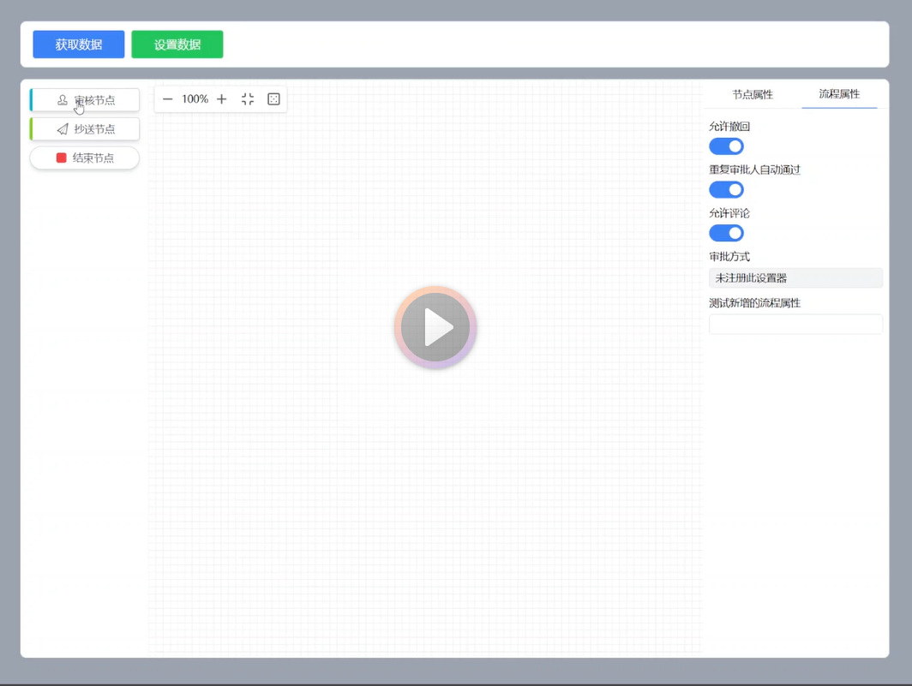
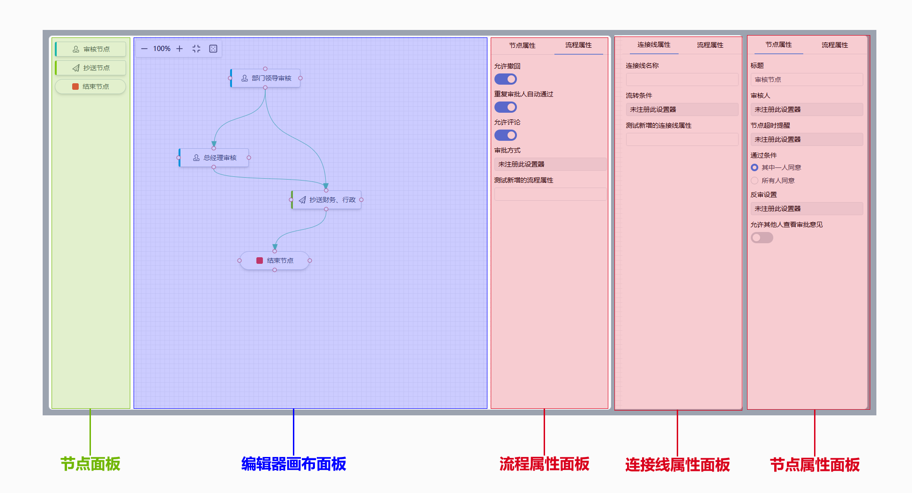

# XFlow Extend 

**XFlow Extend** 是基于 [XFlow](https://github.com/antvis/XFlow) 的扩展项目，旨在简化流程图编辑器的开发，提高开发效率。它提供了简单易用的 API，可以自定义节点、连接线、流程图属性和节点设置器等。

本项目在 WSL:Ubuntu 22.04 下开发，Node.js 版本为 v18.17.0。 如有二次开发有环境问题，可以尝试复刻此开发环境

## 功能特性

- **自定义节点和连接线**：通过简单的 API 自定义节点样式和连接线样式。
- **流程图属性管理**：方便设置和获取流程图属性。
- **内置组件**：提供了一些内置的节点、连接线和设置器，满足大部分流程图编辑需求。

## 视频演示

[](https://github.com/shitiandmw/xflow-extend/assets/130025975/781febe2-d45a-4813-b8ab-666ad5f08723)

## 快速开始

### 环境准备

确保已经安装 Node.js 和 npm。

### 安装

```bash
npm install xflow-extend
```

### 使用

在项目中引入 XFlow Extend：

```javascript
import XFlowExtend from 'xflow-extend';
import 'xflow-extend/dist/style.css'

const App = () => {
  const flowRef = React.useRef();

  // 获取流程图数据
  const getFlowData = () => {
    const flowData = flowRef.current?.getFlowData();
    localStorage.setItem('flowData', JSON.stringify(flowData));
  };

  // 设置流程图数据
  const setFlowData = () => {
    const flowData = JSON.parse(localStorage.getItem('flowData') || '{}');
    flowRef.current?.setFlowData(flowData);
  };

  return <XFlowExtend ref={flowRef} />;
};

export default App;
```

## 自定义接口

### UI 接口

1. **注册自定义节点**
   ```javascript
   registerNode(nodeName: string, node: React.FC, meta: NodeMeta): void;
   ```

2. **注册自定义设置器**
   ```javascript
   registerSetter(setterName: string, setter: React.FC, meta: SetterMeta): void;
   ```

3. **定义连接线样式**
   ```javascript
   setEdgeMeta(meta: setEdgeMetaParams | ((prev: EdgeMeta) => EdgeMeta)): void;
   ```

4. **定义连接线属性**
   ```javascript
   setEdgeProps(newProps: Array<ObjectMetaProps> | ((prev: Array<ObjectMetaProps>) => Array<ObjectMetaProps>)): void;
   ```

5. **定义流程属性**
   ```javascript
   setFlowProps(newProps: Array<ObjectMetaProps> | ((prev: Array<ObjectMetaProps>) => Array<ObjectMetaProps>)): void;
   ```

### 数据接口

1. **获取流程数据**
   ```javascript
   getFlowData(): FlowData;
   ```

2. **设置流程数据**
   ```javascript
   setFlowData(flowData: FlowData): void;
   ```

## 编辑器面板
编辑器面板图如下：



### 节点面板

注册的自定义节点会显示在节点面板上，可以拖拽到编辑器画布上。

**注意：** 节点本质上是一个React组件，可以完全自定义UI和交互逻辑。系统会自动将 `selected` 和 `isCanvas` 两个参数传递给节点组件，用于控制节点的选中状态和是否显示在画布上。例如，以下是审核节点的代码：

#### 示例：自定义节点

```javascript
import { useEffect, useState } from "react";
import Svg from './svg';

const AudioNode = ({ label = "审核节点", selected = false, isCanvas = false }) => {
  const [value, setValue] = useState("");

  useEffect(() => {
    setValue(label);
  }, [label]);

  const canvasRender = (
    <div className={`x-w-full x-h-full x-border x-border-slate-300 x-rounded x-shadow-md x-bg-white x-flex x-items-center x-justify-center x-gap-x-2 x-cursor-pointer x-border-l-4 x-border-l-cyan-500 x-text-gray-600 x-outline-sky-600 ${selected ? "x-outline" : ""}`}>
      <Svg className="x-w-4 x-h-4" />{value}
    </div>
  );

  return canvasRender;
};

export default AudioNode;
```

#### 注册节点

```javascript
import { registerNode } from 'xflow-extend';

registerNode("AudioNode", AudioNode, {
  title: "审核节点",
  category: "节点",
  props: [
    {
      name: "label",
      title: "标题",
      propType: "string",
      setter: "StringSetter",
      defaultValue: "审核节点"
    },
    // 其他属性设置...
  ]
}, 
// 节点在画布上的大小
{
  width: 150,
  height: 40
});
```

### 编辑器画布

编辑器画布用于绘制流程图，显示自定义节点和连接线。

#### 示例：自定义连接线样式

```javascript
import { setEdgeMeta } from 'xflow-extend';

setEdgeMeta({ color: '#000000' });
```

### 属性设置面板

用于修改流程图、节点和连接线的属性。属性设置器通过 `registerSetter` 注册，点击选中的元素会在右侧显示对应的属性设置器。

**注意：** 属性设置器是用于节点、连接线和流程图属性设置与获取的组件。例如，简单的属性（如流程名称）只需要一个输入框（Input）即可处理。而复杂属性（如节点的审核人）可能需要包含更多交互逻辑的组件，甚至可能涉及弹窗设置。因此，属性设置器可以是自定义的。

属性设置器本质上是一个React组件。其props中必须包含 `value` 和 `onChange` 两个属性：`value` 代表当前属性的值，`onChange` 是当属性值发生变化时调用的回调函数，用于通知属性设置器更新。例如，基本的 `StringSetter` 实现如下：

#### 示例：自定义属性设置器

```javascript
const StringSetter = ({ value, onChange }) => {
  const handleChange = (e) => {
    onChange(e.target.value);
  };

  return (
    <div className="x-w-full x-h-7 x-border x-rounded x-overflow-hidden x-bg-gray-100">
      <input
        type="text"
        className="x-border-0 focus:x-outline-none x-w-full x-h-full x-px-2 x-text-gray-700"
        value={value}
        onChange={handleChange}
      />
    </div>
  );
};

export { StringSetter };
```

#### 注册设置器

```javascript
import { registerSetter } from 'xflow-extend';

registerSetter("StringSetter", StringSetter);
```

## 内置设置器

XFlow Extend 提供了几个内置的属性设置器，直接使用即可：
- `StringSetter`：字符串输入框
- `BooleanSetter`：布尔值选择器
- `RadioGroupSetter`：单选框组

### 示例：设置流程属性

```javascript
import { setFlowProps } from 'xflow-extend';

setFlowProps([
  {
    name: "flowName",
    title: "流程名称",
    propType: "string",
    setter: "StringSetter",
    defaultValue: "Demo"
  },
  {
    name: "flowDesc",
    title: "流程描述",
    propType: "string",
    setter: "StringSetter",
    defaultValue: "Demo"
  }
]);
```

### 示例：设置连接线属性

```javascript
import { setEdgeProps } from 'xflow-extend';

setEdgeProps([
  {
    name: "edgeName",
    title: "名称",
    propType: "string",
    setter: "StringSetter",
    defaultValue: "Demo"
  },
  {
    name: "flowDesc",
    title: "流转条件",
    propType: "object",
    setter: "ConditionSetter"
  }
]);
```

### 示例：设置节点属性

通过 `registerNode` 注册的节点，其属性在第三个参数 `meta` 中定义，与 `setFlowProps` 和 `setEdgeProps` 一致。


## 完整示例

```javascript

```

## 许可证

MIT © shitiandmw
